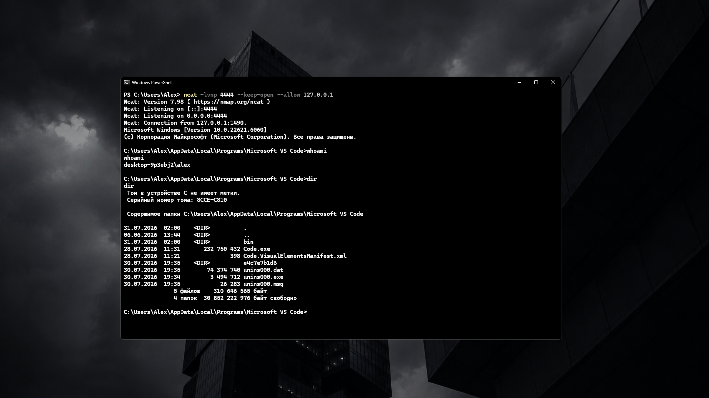
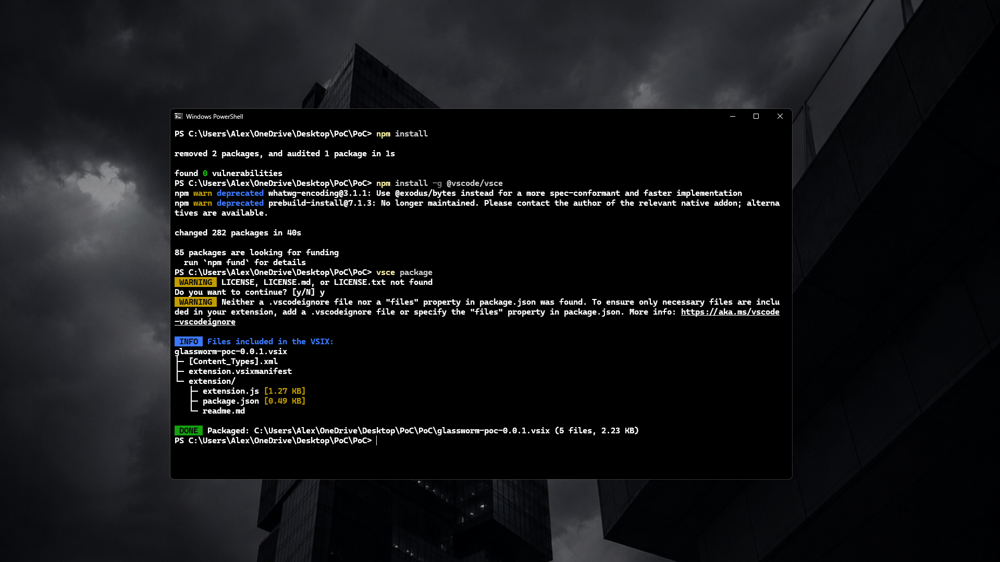

# GlassWorm PoC

> Proof-of-Concept VS Code extension for security research.


---

## Overview

...

---

## Features

- Automatic activation
- Node.js process execution
- TCP communication
- Educational PoC

---

## Demonstration

### 1. Listener

Запустите демонстрационный TCP-сервер.

```bash
ncat -lvnp 4444
```



---

### 2. Install Extension

Откройте папку проекта:

```bash
npm install
```

Установите зависимости.

---

### 3. Build VSIX

```bash
npm install -g @vscode/vsce

vsce package
```

Получится

```
glassworm-poc-0.0.1.vsix
```

---

### 4. Install in VS Code

```
Extensions
→ ...
→ Install from VSIX...
```

Выберите созданный `.vsix`.



---

### 5. Launch VS Code

После запуска расширение автоматически активируется.

---

## Project Structure

```text
.
├── extension.js
├── package.json
├── README.md
└── images
    ├── extension.png
    ├── install.png
    └── ncat.png
```

---

## Disclaimer

Educational security research only.

Only use in environments where you have explicit authorization.

